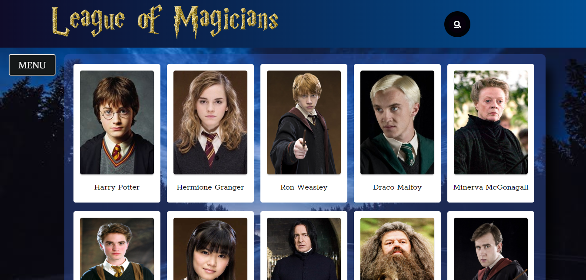
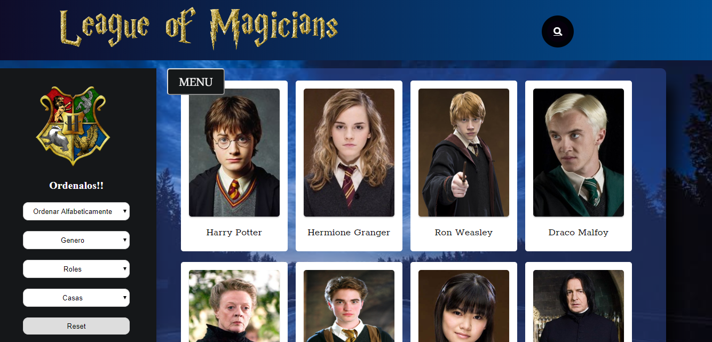

# Data Lovers

## Índice

* [1. Resumen del proyecto](#1-Resumen-del-proyecto)
* [2. Historias de Usuario](#2-Historias-de-Usuario)
* [Prototipo de baja Fidelidad](#4-Prototipo-de-baja-Fidelidad)
* [5. Criterios de aceptación mínimos del proyecto](#5-criterios-de-aceptación-mínimos-del-proyecto)
* [6. Parte adicional-opcional (extensión)](#6-parte-adicional-opcional-extensión)
* [7. Consideraciones técnicas](#7-consideraciones-técnicas)
* [8. Pistas, tips y lecturas complementarias](#8-pistas-tips-y-lecturas-complementarias)

***

## 1. Resumen del proyecto

**League of Magicians** es una página para que puedas conocer a todos los personajes de la saga Harry Potter donde podras filtrar o buscar a tus personaje favoritos como.

- Ordenalos de forma Alfabeticamente
- Filtrar por genero, roles, casas

Tambien contaras con un boton **Reset** para que puedas volver a inicio.

## 2. Historias de Usuario

- **H1** Yo como usuario quiero ver todos los personajes en una lista
- **H2** Yo como usuario quiero ver las caracteristicas de cada personaje
- **H3** Yo como usuario quiero ordenar los persoajes por nombre
- **H4** Yo como usuario quiero poder ver los personajes por genero
- **H5** Yo como usuario quiero poder ver los diferentes roles de cada personaje
- **H6** Yo como usuario quiero poder ver las distintas casas
- **H7** Yo como usuario quiero poder buscar a los personajes rapidamente
- **H8** Yo como usuario quiero tener un boton reset para volver al inicio

## Prototipo de baja Fidelidad

## Prototipo de alta Fidelidad

## Imagen final del proyecto

## Objetivos de Aprendizaje

### UX

- [x] Diseñar la aplicación pensando y entendiendo al usuario.
- [x] Crear prototipos para obtener _feedback_ e iterar.
- [ ] Aplicar los principios de diseño visual (contraste, alineación, jerarquía).
- [x] Planear y ejecutar _tests_ de usabilidad.

### HTML y CSS

- [ ] Entender y reconocer por qué es importante el HTML semántico.
- [x] Identificar y entender tipos de selectores en CSS.
- [x] Entender como funciona `flexbox` en CSS.
- [x] Construir tu aplicación respetando el diseño planeado (maquetación).

### DOM

- [x] Entender y reconocer los selectores del DOM (querySelector | querySelectorAll).
- [x] Manejar eventos del DOM. (addEventListener)
- [x] Manipular dinámicamente el DOM. (createElement, appendchild, innerHTML, value)

### Javascript

- [x] Manipular arrays (`filter` | `map` | `sort` | `reduce`).
- [x] Manipular objects (key | value).
- [x] Entender el uso de condicionales (`if-else` | `switch`).
- [x] Entender el uso de bucles (`for` | `forEach`).
- [ ] Entender la diferencia entre expression y statements.
- [x] Utilizar funciones (parámetros | argumentos | valor de retorno).
- [x] Entender la diferencia entre tipos de datos atómicos y estructurados.
- [x] Utilizar ES Modules (`import` | `export`).

### Pruebas Unitarias (_testing_)
- [x] Testear funciones (funciones puras).

### Git y GitHub
- [x] Ejecutar comandos de git (`add` | `commit` | `pull` | `status` | `push`).
- [x] Utilizar los repositorios de GitHub (`clone` | `fork` | gh-pages).
- [x] Colaborar en Github (pull requests).

### Buenas prácticas de desarrollo
- [x] Organizar y dividir el código en módulos (Modularización).
- [ ] Utilizar identificadores descriptivos (Nomenclatura | Semántica).
- [x] Utilizar linter para seguir buenas prácticas (ESLINT).

